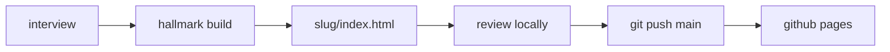

```
 ██████╗  ██╗ ████████╗  ██████╗ ██╗  ██╗
 ██╔══██╗ ██║ ╚══██╔══╝ ██╔════╝ ██║  ██║
 ██████╔╝ ██║    ██║    ██║      ███████║
 ██╔═══╝  ██║    ██║    ██║      ██╔══██║
 ██║      ██║    ██║    ╚██████╗ ██║  ██║
 ╚═╝      ╚═╝    ╚═╝     ╚═════╝ ╚═╝  ╚═╝
```

<div align="center">

### `A LINK, NOT A PARAGRAPH IN THE GROUP CHAT`

*one folder per pitch, one html file per folder, served off github pages*


</div>

---

## 📡 What is this

Sometimes you need to sell someone on something. A hackathon crew, a tool for
your dad, a side quest nobody asked for. Writing four paragraphs into a group
chat does not work, because nobody reads four paragraphs in a group chat.

So this repo holds pitch sites. Each one is a folder with a single
self-contained `index.html` — no framework, no build step, no npm install that
takes longer than the pitch itself. GitHub Pages serves them straight off
`main`. Push, wait thirty seconds, send the link.

The sites are built by a Claude Code skill called `/pitch`, which lives in
`~/.claude/skills/pitch` rather than in this repo. It interviews you before it
writes anything: who reads this, what is the one action, what is actually
true, why do they say no. The interview is the part that matters. A pitch you
cannot defend under questioning is not going to survive a group chat either.

```console
nick@pitch:~$ /pitch
[?] who exactly reads this. names, not "people interested in x"
[?] three real objections. strawmen do not count.
[✓] flight-001/index.html — 15kb, zero dependencies, zero external js
[i] live in ~30s at nitrimandylis.github.io/pitch/flight-001/
```

## 🔥 The interview

| | question | what it actually forces |
|---|---|---|
| 01 | **who reads this** | names or a tight description. "people interested in x" gets rejected |
| 02 | **the one action** | reply "in". show up saturday. one. if there are two, one of them is the real one |
| 03 | **what is true** | dates, numbers, costs, links. nothing reaches the page that did not come out of this answer |
| 04 | **why they say no** | three real objections and three honest answers. "it is not that much time" is a lie, not an answer |
| 05 | **the hook** | one sentence, said out loud. needs a second sentence to land? not the hook yet |
| 06 | **the tone** | deadpan, earnest, formal — and what would make the reader cringe |
| 07 | **the slug** | lowercase, hyphenated, checked against the folders already here |

Only after all seven does anything get built. The build hands the answers to
[hallmark](https://github.com/nitrimandylis), which reads
`.hallmark/log.json` and picks a structure and theme no recent pitch used — so
two pitches do not come out as colour-swaps of each other.

## 🚀 Run it

There is nothing to install. The sites are static files.

```bash
git clone https://github.com/nitrimandylis/pitch.git
cd pitch
open flight-001/index.html
```

To add one, open Claude Code in this directory and invoke `/pitch`. It pulls,
grills, builds, opens the result locally for you to look at, and asks before it
pushes. Pushing is the deploy.

## 🔩 Under the hood



| layer | path | job |
|---|---|---|
| listing | `index.html` | plain list of every pitch. one `<li>` per site, inserted under a marker comment |
| a pitch | `<slug>/index.html` | the whole site. html, css and any js in one file |
| preview image | `<slug>/og.png` | 1200x1200 link preview, generated with pillow on every build. the thumbnail is the first thing anyone sees |
| theme memory | `.hallmark/log.json` | append-only record of which structure and theme each pitch used. this is what stops them rhyming |
| house rules | `CLAUDE.md` | absolute og: urls, never touch an existing pitch folder, no real names, no school branding |
| direction | `PRODUCT.md` | what this is and what is next. currently: "add pitches, not features" |

**Stack:** html · css · github pages · no build step

---

<div align="center">

**[Nick Trimandylis](https://github.com/nitrimandylis)**

`IF IT NEEDS A SECOND SENTENCE IT IS NOT THE HOOK`

MIT licensed — see [LICENSE](LICENSE).

</div>
